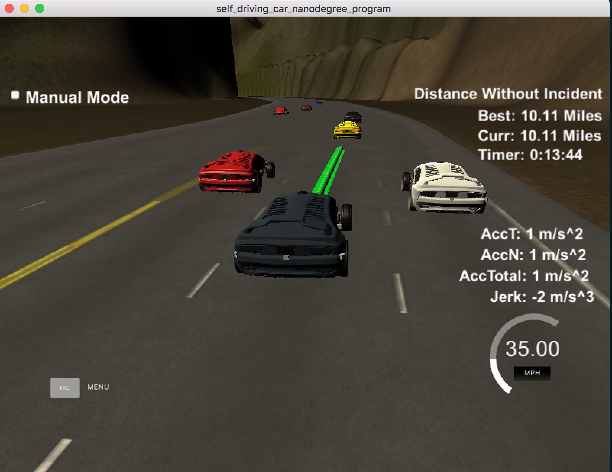
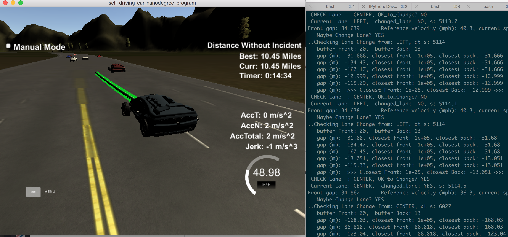
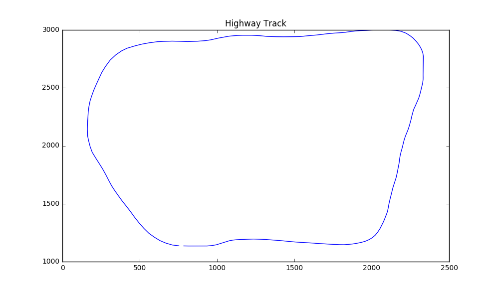

# CarND-Path-Planning-Project
Self-Driving Car Engineer Nanodegree Program

The objective of this project is to have a simulated car drive itself safely along a ~7 mile highway loop, in traffic, without colliding into other vehicles while changing lanes, at around 50 miles/hour. The simulated car (called Ego vehicle) is the black car, and should speed up / down, accelerate / decelerate within limits. The limits are:

- max speed: 50 miles/hour
- max accelerate 10 m/s^2
- max jerk 10 m/s^3 (derivative of acceleration)

### TLDR:

Here's the summary video of the car driving along the highway without any violations.
[Video[See video on YouTube]](https://youtu.be/oVQDk5aBwvI)

Screenshots


Simulator with debug info:


### Highway

Here's a quick snapshot of the highway.


## Path Planning Approach

The approach for this project is somewhat based on the project walkthrough. 

We use Frenet coordinates (s, d) instead of regular X,Y coordinates as this simplifies the path planning. In Frenet coordinates, **s** denotes _longitudinal displacement along the road_, while **d** denotes _lateral displacement from the center (yellow) dividing line_. The track is approx. 6947 meters long, thus `s` varies from 0-6947 (length of the track). The `d` value shows distance away from center divider: each lane is 4 meters wide, and there are three lanes: Left, Center, Right. Thus, the `d` value for Left lane will be `0 < d < 4`, for Center lane (`4 < d < 8`), and for Right lane (`8 < d < 12`). Thus, the `(s,d)` coordinates fully specify a car's position on the track.

We use Frenet coordinates with transforms and spline interpolation to generate paths. As the picture above shows, the highway map is a loop, and in Frenet coordinates the outline is jagged and has sharply cut line segments. This results in sharp acceleration and jerk around the corners. To help smooth this out, _spline interpolation_ was used.


The key elements of the project are broken down into three parts: 

- Sensor Fusion: understanding (nearby) traffic
- Path Planning: determining lane change behavior
- Trajectory construction

### Sensor Fusion - Analyzing Traffic Information

In a typical self-driving car, various sensors (LIDARs, radars, cameras, etc.) continously provide enviroment information to answer key questions: What objects are nearby? How far are they? Are they static or dynamic? How fast and in what direction are they traveling? Etc. 

The simulator in this particular case provides a smaller subset of information: Cars traveling in this side of the Ego car. It does not provide any info on cars in the opposite side of the road (i.e. on-coming traffic). The highway track is a 3-lane highway on each side. The Ego car starts in the Center lane, and then drives itself based on near-by traffic.

In our implementation, the Ego car first analyzes sensor fusion data to determine its **reference velocity** 
-- Is there a car in our lane, infront of us, within 30 meters? If so, follow its speed
-- Is there a car in our lane, within 20 meters? If so, slow down to something _less than_ leading car's speed
-- If no car ahead of us, maintain a _reference speed_ of **49 miles/hour**, so that we don't violate speed limit

This is implemented in lines 275-332 of main.cpp. 

### Path Planning: Lane Change Behavior

For lane change behavior, we use some simple heuristics. The car prefers to stay in its lane, unless there's traffic ahead, in which case, it will try to find a lane it can _safely_ move into.

1. Stay in the lane, and drive at _reference velocity_ for as long as possible.
2. If there's traffic ahead (as determined above), flag for a lane change.
3. First, check the traffic in the lane _left of current lane_ (if it exists, i.e. if the ego car is not already in Left lane). Find the _closest front_ and _closest back_ gaps in this lane. Only if there's enough space in the front (20 meter buffer) and back (13 meter buffer), set **target lane** to this lane.
4. If the above (left-er) lane isn't available to change into, check traffic in the lane _right of the current lane_ (if such a lane exists, i.e. car is not already in the extreme Right lane). Perform the same evaluation, and set **target lane** to this lane.

This is implemented in lines 334-388 in main.cpp and in the function `is_lane_safe()` (lines 66-144).

### Trajectory Construction

As mentioned, we use Frenet coordinates (s, d) for path construction based on reference velocity and target `d` value for the target lane. Instead of a large number of waypoints, we use three waypoints widely spaced (at 30 meters interval) and interpolate a smooth path between these using spline interpolation. These are the _anchor points_. (This technique is discussed in the project walkthrough). To ensure that acceleration stays under 10 m/s^2, a constant acceleration is added to or subtracted from the reference velocity. The three anchor points are converted to the local coordinate space (via shift and rotation), and interpolated points are evenly spaced out such that each point is traversed in 0.02 seconds (the `time interval`). This is implemented in lines 420-493 in main.cpp. The points are then converted back to frenet coordinates, and fed to the simulator.

## Results

The ego car can safely drive around the entire track at just under 50 miles/hour, without any violations. I ran the simulator for various lengths (5 miles to 12 miles) successfully. 

Here is a resulting video showing a successful 5-mile drive.

[Video[See video on YouTube]](https://youtu.be/oVQDk5aBwvI)

### Improvements

The ego car drives itself fully autonomously along the entire highway track. However, there are limitations because of the simplified logic. Since the ego car prefers to stay in its lane and test for a safe _left_ lane first, it can get stuck behind a slow moving car if there's traffic in the left lane, even if the right lane is empty, although it does find its way correctly. Also, at times, the ego car can switch back and forth between Left lane to Center lane, due to traffic ahead, although this too is eventually handled.

Secondly, currently only _implicit costs_ are awarded for lane change behavior. That is, the costs are binary 0/1 if a lane is safe to move into or not. A better alternative would be using true cost functions that give varying costs based on:

- trajectories available
- traffic in neighboring lanes
- acceleration / jerk values
- collision avoidance

Thirdly, a *Jerk Minimization* technique could be used that smoothes out, using a quintic polynomial, the possible trajectories available to the ego car.

Fourth, one could project the future behavior of traffic and try to predict their trajectory and thus make the car more proactive.

---

### Simulator.
You can download the Term3 Simulator which contains the Path Planning Project from the [releases tab (https://github.com/udacity/self-driving-car-sim/releases).

### Goals
In this project your goal is to safely navigate around a virtual highway with other traffic that is driving +-10 MPH of the 50 MPH speed limit. You will be provided the car's localization and sensor fusion data, there is also a sparse map list of waypoints around the highway. The car should try to go as close as possible to the 50 MPH speed limit, which means passing slower traffic when possible, note that other cars will try to change lanes too. The car should avoid hitting other cars at all cost as well as driving inside of the marked road lanes at all times, unless going from one lane to another. The car should be able to make one complete loop around the 6946m highway. Since the car is trying to go 50 MPH, it should take a little over 5 minutes to complete 1 loop. Also the car should not experience total acceleration over 10 m/s^2 and jerk that is greater than 50 m/s^3.

#### The map of the highway is in data/highway_map.txt
Each waypoint in the list contains  [x,y,s,dx,dy] values. x and y are the waypoint's map coordinate position, the s value is the distance along the road to get to that waypoint in meters, the dx and dy values define the unit normal vector pointing outward of the highway loop.

The highway's waypoints loop around so the frenet s value, distance along the road, goes from 0 to 6945.554.

## Basic Build Instructions

1. Clone this repo.
2. Make a build directory: `mkdir build && cd build`
3. Compile: `cmake .. && make`
4. Run it: `./path_planning`.

Here is the data provided from the Simulator to the C++ Program

#### Main car's localization Data (No Noise)

["x"] The car's x position in map coordinates

["y"] The car's y position in map coordinates

["s"] The car's s position in frenet coordinates

["d"] The car's d position in frenet coordinates

["yaw"] The car's yaw angle in the map

["speed"] The car's speed in MPH

#### Previous path data given to the Planner

//Note: Return the previous list but with processed points removed, can be a nice tool to show how far along
the path has processed since last time. 

["previous_path_x"] The previous list of x points previously given to the simulator

["previous_path_y"] The previous list of y points previously given to the simulator

#### Previous path's end s and d values 

["end_path_s"] The previous list's last point's frenet s value

["end_path_d"] The previous list's last point's frenet d value

#### Sensor Fusion Data, a list of all other car's attributes on the same side of the road. (No Noise)

["sensor_fusion"] A 2d vector of cars and then that car's [car's unique ID, car's x position in map coordinates, car's y position in map coordinates, car's x velocity in m/s, car's y velocity in m/s, car's s position in frenet coordinates, car's d position in frenet coordinates. 

## Details

1. The car uses a perfect controller and will visit every (x,y) point it recieves in the list every .02 seconds. The units for the (x,y) points are in meters and the spacing of the points determines the speed of the car. The vector going from a point to the next point in the list dictates the angle of the car. Acceleration both in the tangential and normal directions is measured along with the jerk, the rate of change of total Acceleration. The (x,y) point paths that the planner recieves should not have a total acceleration that goes over 10 m/s^2, also the jerk should not go over 50 m/s^3. (NOTE: As this is BETA, these requirements might change. Also currently jerk is over a .02 second interval, it would probably be better to average total acceleration over 1 second and measure jerk from that.

2. There will be some latency between the simulator running and the path planner returning a path, with optimized code usually its not very long maybe just 1-3 time steps. During this delay the simulator will continue using points that it was last given, because of this its a good idea to store the last points you have used so you can have a smooth transition. previous_path_x, and previous_path_y can be helpful for this transition since they show the last points given to the simulator controller with the processed points already removed. You would either return a path that extends this previous path or make sure to create a new path that has a smooth transition with this last path.

## Tips

A really helpful resource for doing this project and creating smooth trajectories was using http://kluge.in-chemnitz.de/opensource/spline/, the spline function is in a single hearder file is really easy to use.

---

## Dependencies

* cmake >= 3.5
 * All OSes: [click here for installation instructions](https://cmake.org/install/)
* make >= 4.1
  * Linux: make is installed by default on most Linux distros
  * Mac: [install Xcode command line tools to get make](https://developer.apple.com/xcode/features/)
  * Windows: [Click here for installation instructions](http://gnuwin32.sourceforge.net/packages/make.htm)
* gcc/g++ >= 5.4
  * Linux: gcc / g++ is installed by default on most Linux distros
  * Mac: same deal as make - [install Xcode command line tools]((https://developer.apple.com/xcode/features/)
  * Windows: recommend using [MinGW](http://www.mingw.org/)
* [uWebSockets](https://github.com/uWebSockets/uWebSockets)
  * Run either `install-mac.sh` or `install-ubuntu.sh`.
  * If you install from source, checkout to commit `e94b6e1`, i.e.
    ```
    git clone https://github.com/uWebSockets/uWebSockets 
    cd uWebSockets
    git checkout e94b6e1
    ```

## Editor Settings

We've purposefully kept editor configuration files out of this repo in order to
keep it as simple and environment agnostic as possible. However, we recommend
using the following settings:

* indent using spaces
* set tab width to 2 spaces (keeps the matrices in source code aligned)

## Code Style

Please (do your best to) stick to [Google's C++ style guide](https://google.github.io/styleguide/cppguide.html).

## Project Instructions and Rubric

Note: regardless of the changes you make, your project must be buildable using
cmake and make!


## Call for IDE Profiles Pull Requests

Help your fellow students!

We decided to create Makefiles with cmake to keep this project as platform
agnostic as possible. Similarly, we omitted IDE profiles in order to ensure
that students don't feel pressured to use one IDE or another.

However! I'd love to help people get up and running with their IDEs of choice.
If you've created a profile for an IDE that you think other students would
appreciate, we'd love to have you add the requisite profile files and
instructions to ide_profiles/. For example if you wanted to add a VS Code
profile, you'd add:

* /ide_profiles/vscode/.vscode
* /ide_profiles/vscode/README.md

The README should explain what the profile does, how to take advantage of it,
and how to install it.

Frankly, I've never been involved in a project with multiple IDE profiles
before. I believe the best way to handle this would be to keep them out of the
repo root to avoid clutter. My expectation is that most profiles will include
instructions to copy files to a new location to get picked up by the IDE, but
that's just a guess.

One last note here: regardless of the IDE used, every submitted project must
still be compilable with cmake and make./
